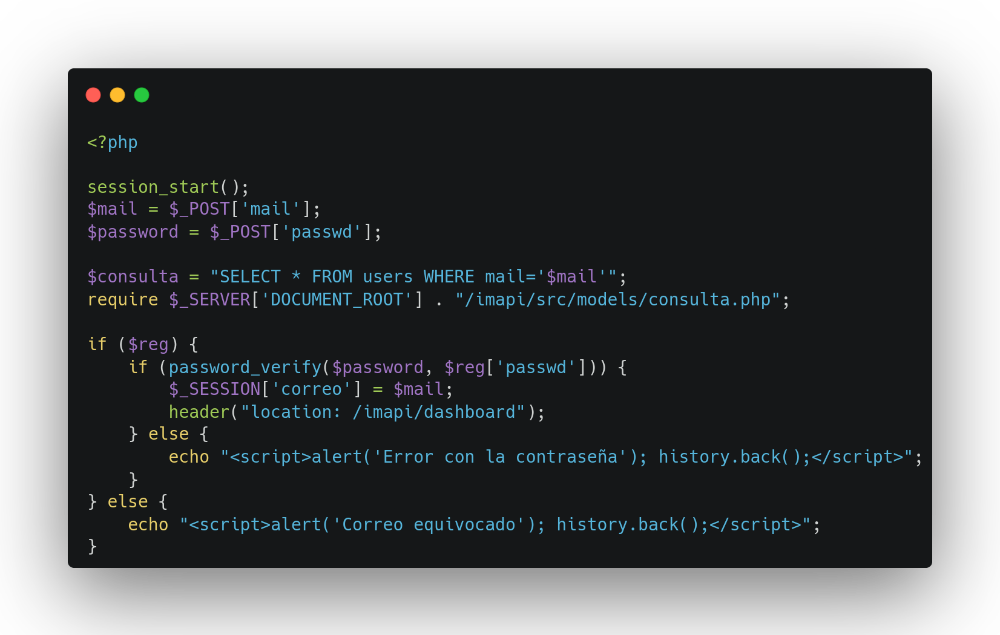
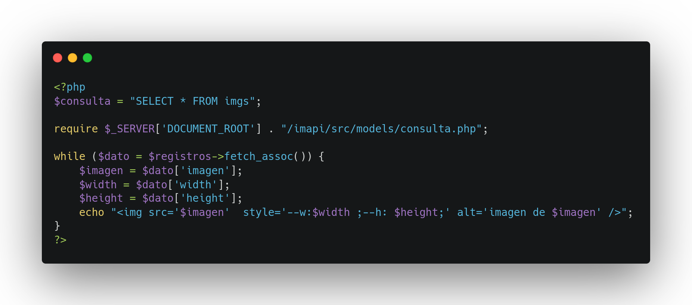
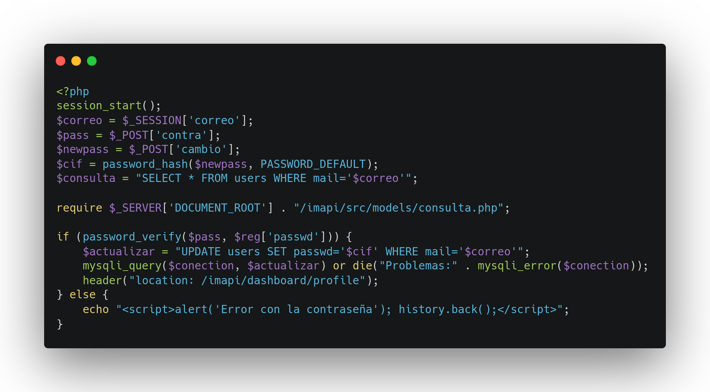
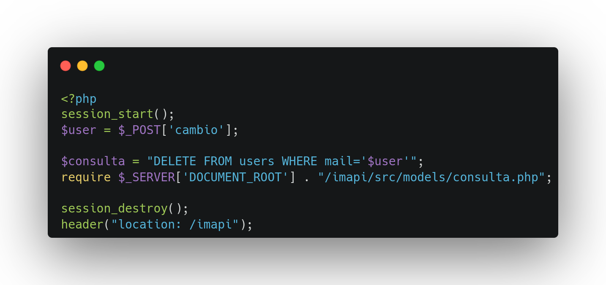
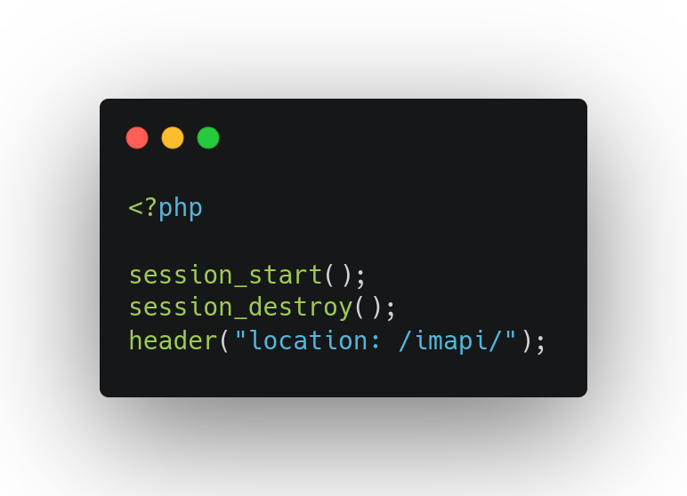
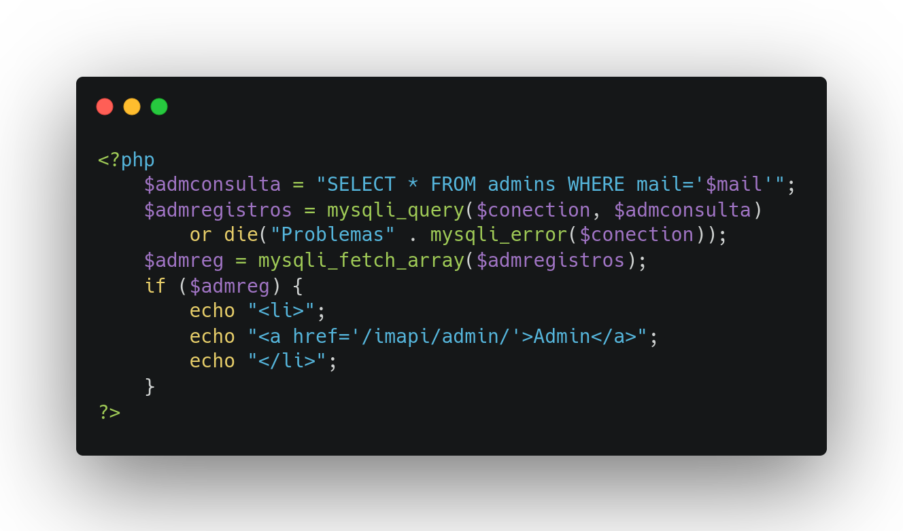
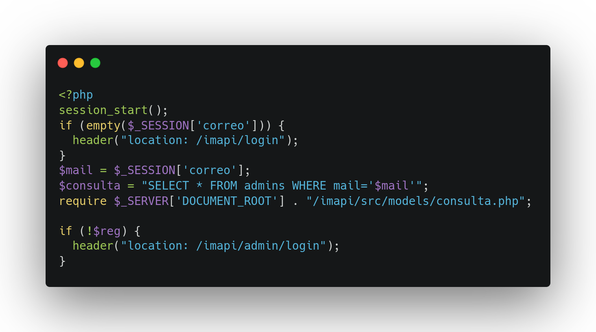
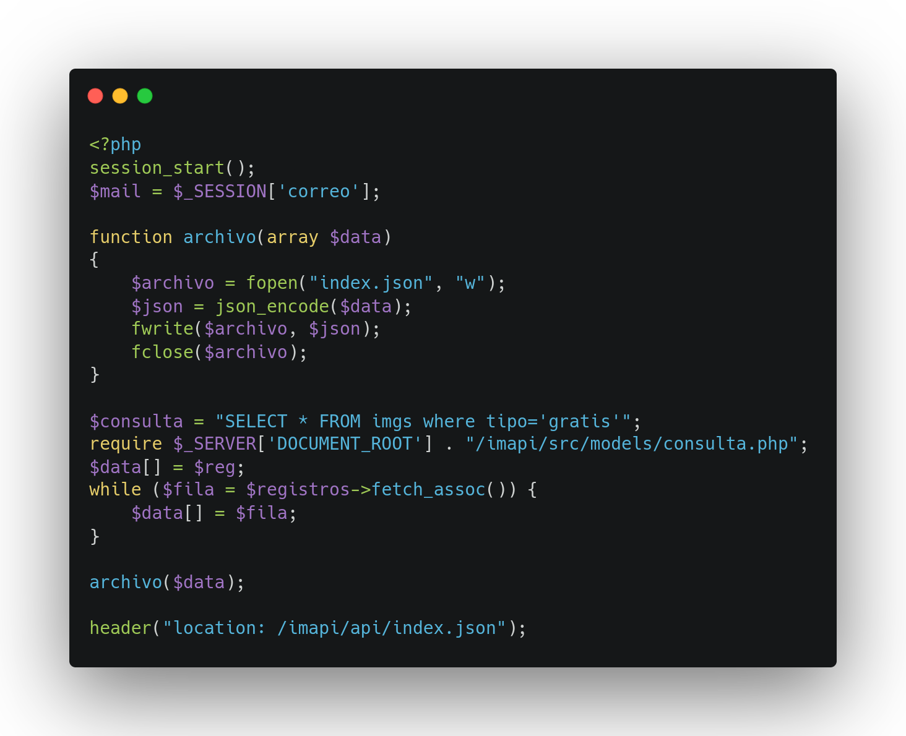

# IMAPI

> API rest de imágenes en PHP

**Páginas disponibles:**

- `/`: Índice.
- `/signup`: Registro.
- `/login`: Inicio de sesión.
- `/dashboard`: Página principal.
  - `/profile`: Página del perfil.
- `/admin`: Zona de administración.
  - `/login`: Inicio de sesión de administradores.
  - `/add`: Página para añadir administradores
- `api`: API.

## `/`

Esta página es la puerta de entrada a la web. Tiene dos botones principales:

- Entrar
- Registro

### Entrar

Este botón lleva directamente al `/dashboard`. En caso de no haber iniciado sesión, te lleva al `/login`.

### Registro

En esta zona te lleva al `/signup`.

## `/signup`

Esta es la zona del registro.
Casos en los que no se lleva a cabo el registro:

- No hay nombre.
- No hay contraseña.
- No hay email.
- No acepta la política de privacidad.
- Las contraseñas no coinciden.
- El mail no es válido.

Estas comprobaciones las realiza un archivo externo llamado `main.js`, situado dentro de `src/js/main.js`.

Aparte, hay un botón y un texto que te llevan al `login`.

## `/login`

En esta página debes meter tus credenciales de usuario. Ambos inputs son obligatorios gracias al atributo `required`.

Una vez se envía esta información, llega al `login.php`, que contiene el siguiente código:

En este archivo iniciamos la sesión porque en caso de que el correo exista y la contraseña introducida sea la misma que la que hay en la base de datos, guardaremos el correo en la sesión.

En caso de que alguna de esas dos comprobaciones no se cumpla, envía una alerta y vuelve al login con el `history.back()`.

Si el inicio de sesión se cumple, te lleva al `dashboard`.

## `/dashboard`

Esta página es la principal, es la que muestra las imágenes disponibles en la api.

Para mostrar las fotos de la Base de datos se hace el siguiente bucle:

Se hace la consulta a la base de datos y luego, de los registros que coinciden con la consulta, se hace un bucle para sacar un array asociativo. De este se saca la imagen, con su ancho y alto.

En el `nav` de esta página hay 3 enlaces:

### Perfil

Página del perfil en la que puedes ver tus datos y modificarlos.

Los datos que puedes modificar son:

- Nombre.
- Correo.
- Contraseña.

Por ejemplo, al modificar la contraseña, se hace una verificación de que la 'contraseña actual' coincide con la almacenada en la base de datos. Se cifra la contraseña nueva y se actualiza la base de datos con ella:

En esta página también se puede borrar la cuenta. Se usa un input de tipo `hidden` que envía el correo al archivo `deleteaccount.php`, que contiene esto:

### Cerrar sesión: `/logout`

Esto lleva al `logout`, el cual contiene el siguiente código:

Esta página destruye la sesión y devuelve al inicio.

### Admin

Este enlace solo se muestra si eres un administrador. Este renderizado condicional se hace gracias al siguiente código:

Hace una comprobación para saber si el correo está en admins o no.

## `/admin`

Esta es la zona de administración, donde se pueden agregar las imágenes a la base de datos.
Una peculiaridad de esta zona, es que si intentas acceder si no eres admin no puedes. Esto se consigue con lo siguiente:

Si no eres admin te redirecciona al login de admins.

### Login

En esta página los admins pueden iniciar sesión.

### Add

En esta zona se pueden añadir administradores nuevos. Solo un administrador puede añadir un nuevo administrador.

## `/api`

Esta es la parte más importante de la web. Aquí se generará un archivo json y se redirigirá a el:

Al igual que en el `dashboard`, se hace un bucle para recorrer la base de datos y guardarlo todo en el array datos, que es el que se pasa por la función archivo.
